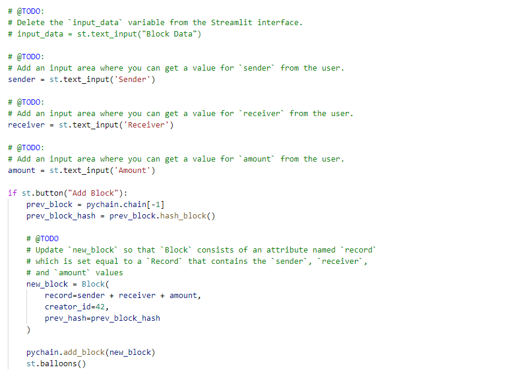

# PyChain-Ledger
To build a blockchain-based ledger system, complete with a user-friendly web interface. This ledger should allow partner banks to conduct financial transactions (that is, to transfer money between senders and receivers) and to verify the integrity of the data in the ledger.


The steps for this project are divided into the following sections:

1. Create a new data class named ```Record```. This class will serve as the blueprint for the financial transaction records that the blocks of the ledger will store.
2. Change the existing ```Block``` data class by replacing the generic ```data``` attribute with a ```record``` attribute that’s of type ```Record```.
3. Create additional user input areas in the Streamlit application. These input areas should collect the relevant information for each financial record that you’ll store in the ```PyChain``` ledger.
4. Test your complete ```PyChain``` ledger.


---

## Technologies

This project leverages Anaconda and JupyterLab with Python 3.9:

* [Anaconda](https://www.anaconda.com/products/individual) 

Need to import the following libraries and dependencies:

```
import streamlit as st
from dataclasses import dataclass
from typing import Any, List
import datetime as datetime
import pandas as pd
import hashlib

```

---

## Installation Guide

Before running the application first install the following dependencies.

1. Install [Anaconda](https://www.anaconda.com/products/individual) from link 
2. Open up GitBash(Windows) or Terminal(Mac)
3. Type ```conda update conda``` to update Conda
4. Type ```conda update anaconda``` to update Anaconda
5. Type ```conda create -n dev python=3.9 anaconda```
6. Type ```conda activate dev``` to activate conda
7. Install a dev environment kernel by typing ```python -m ipykernel install --user --name dev```
8. Install a node environment by typing ```conda install -c conda-forge nodejs```
9. Launch JupyterLab by typing ```jupyter lab```

Open a terminal window, and then activate your ```dev``` virtual environment by running the following command:
```
conda activate dev 
```
Install Streamlit by running the following command:

```
pip install streamlit
```

---

## Usage

You will need to clone the repo so that you can run the application:

```
https://github.com/locthai2002/PyChain-Ledger.git

```

Here are some screenshots from running the application:

## Create a new data class named ```Record```


## Change the existing ```Block``` data class


## Create additional user input areas in the Streamlit application



## Test your complete ```PyChain``` ledger


---

## Contributors

Loc Thai -- www.linkedin.com/in/loc-thai-69b8a2141
Phone: 415.400.9998

---

## License

MIT
