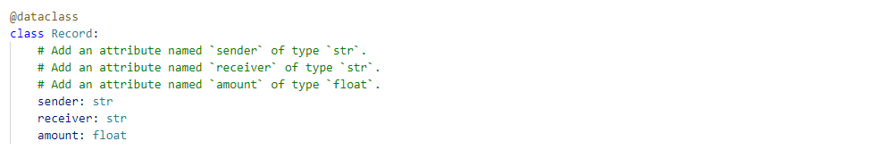
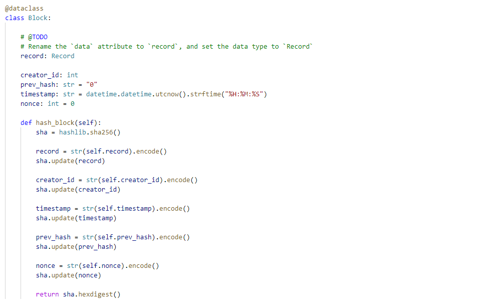

# PyChain-Ledger
To build a blockchain-based ledger system, complete with a user-friendly web interface. This ledger should allow partner banks to conduct financial transactions (that is, to transfer money between senders and receivers) and to verify the integrity of the data in the ledger.


The steps for this project are divided into the following sections:

1. Create a new data class named ```Record```. This class will serve as the blueprint for the financial transaction records that the blocks of the ledger will store.
2. Change the existing ```Block``` data class by replacing the generic ```data``` attribute with a ```record``` attribute that’s of type ```Record```.
3. Create additional user input areas in the Streamlit application. These input areas should collect the relevant information for each financial record that you’ll store in the ```PyChain``` ledger.
4. Test your complete ```PyChain``` ledger.


---

## Technologies

This project leverages Anaconda and JupyterLab with Python 3.9:

* [Anaconda](https://www.anaconda.com/products/individual) 

Need to import the following libraries and dependencies:

```
import numpy as np
import pandas as pd
from pathlib import Path
from sklearn.metrics import balanced_accuracy_score
from sklearn.metrics import confusion_matrix
from imblearn.metrics import classification_report_imbalanced

import warnings
warnings.filterwarnings('ignore')
```

---

## Installation Guide

Before running the application first install the following dependencies.

1. Install [Anaconda](https://www.anaconda.com/products/individual) from link 
2. Open up GitBash(Windows) or Terminal(Mac)
3. Type ```conda update conda``` to update Conda
4. Type ```conda update anaconda``` to update Anaconda
5. Type ```conda create -n dev python=3.9 anaconda```
6. Type ```conda activate dev``` to activate conda
7. Install a dev environment kernel by typing ```python -m ipykernel install --user --name dev```
8. Install a node environment by typing ```conda install -c conda-forge nodejs```
9. Launch JupyterLab by typing ```jupyter lab```

Open a terminal window, and then activate your ```dev``` virtual environment by running the following command:
```
conda activate dev 
```
Install imbalance-learn by running the following command:

```
conda install -c conda-forge imbalanced-learn 
```
Install PyDotPlus by running the following command:

```
conda install -c conda-forge pydotplus
```
---

## Usage

You will need to clone the repo so that you can run the application:

```
 https://github.com/locthai2002/Credit-Risk-Resampling.git

```

Here are some screenshots from running the application:

## Import the Data



## Split the Data into Training and Testing Sets




## Create a Logistic Regression Model with the Original Data


## Predict a Logistic Regression Model with Resampled Training Data


## Write a Credit Risk Analysis Report


---

## Contributors

Loc Thai -- www.linkedin.com/in/loc-thai-69b8a2141
Phone: 415.400.9998

---

## License

MIT
